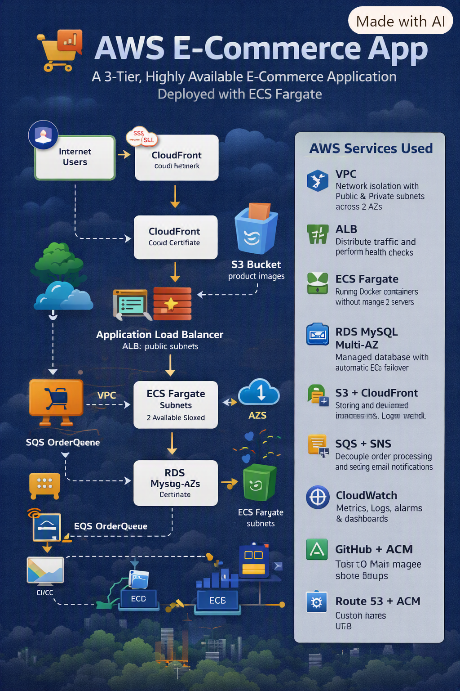

# AWS Ecommerce App 
*A 3-Tier, Highly Available E-Commerce Application Deployed with ECS Fargate*

---

## 📌 Project Overview
This project demonstrates a production-ready e-commerce application deployed on AWS. 
The goal was to design a scalable, secure, and monitored 3-tier architecture using core AWS services.

*Key Highlights:*
- Migrated from EC2 to serverless *ECS Fargate* for zero server management
- Implemented CI/CD with *GitHub Actions*
- Built for *High Availability* across 2 Availability Zones

---

## 🏗️ Architecture
                    +-------------------+
                    |       Users       |
                    +---------+---------+
                              |
                              v
                    +-------------------+
                    |     Amazon Route 53|
                    +---------+---------+
                              |
                              v
                    +-------------------+
                    |    Amazon CloudFront|
                    +---------+---------+
                              |
                +-------------+-------------+
                |                           |
                v                           v
      +-------------------+       +-------------------+
      |   Frontend (S3)    |       | Application Load  |
      |  HTML/CSS/React    |       |     Balancer      |
      +-------------------+       +---------+---------+
                                            |
                                            v
                                  +-------------------+
                                  |     EC2 Instance  |
                                  |  Backend (Spring  |
                                  |  Boot/Node.js)    |
                                  +---------+---------+
                                            |
                    +-----------------------+-----------------------+
                    |                                               |
                    v                                               v
          +-------------------+                         +-------------------+
          |     Amazon RDS    |                         |      Amazon S3    |
          | (MySQL/PostgreSQL)|                         |  Product Images   |
          +-------------------+                         +-------------------+

                                            |
                                            v
                                  +-------------------+
                                  |   Amazon Cognito  |
                                  | Authentication    |
                                  +-------------------+

                                            |
                                            v
                                  +-------------------+
                                  | Amazon CloudWatch |
                                  |     Monitoring    |
                                  +-------------------+

---

## 🛠️ AWS Services Used

| Service | Purpose |
| --- | --- |
| *VPC* | Network isolation with Public + Private subnets across 2 AZs |
| *ALB* | Distribute traffic and perform health checks |
| *ECS Fargate* | Run Docker containers without managing EC2 servers |
| *RDS MySQL Multi-AZ* | Managed database with automatic failover |
| *S3 + CloudFront* | Store and deliver product images with low latency |
| *SQS + SNS* | Decouple order processing and send email notifications |
| *CloudWatch* | Metrics, Logs, Alarms, and Dashboard |
| *CloudTrail* | Audit API calls for security and compliance |
| *Route53 + ACM* | Custom domain name with HTTPS |
| *ECR + GitHub Actions* | CI/CD pipeline for automated deployments |

---

## ✅ Requirements

### Functional Requirements
1.  Product Catalog: Users can view products with images
2.  Add to Cart: Users can add products to cart
3.  Place Order: Orders are stored in RDS
4.  Notifications: Email sent to admin on new order via SNS
5.  Image Storage: Product images stored in S3 and delivered via CloudFront

### Non-Functional Requirements
1.  *High Availability*: Multi-AZ deployment for app and database
2.  *Scalability*: Auto Scaling for ECS Fargate based on CPU
3.  *Security*: Application in private subnet. Only ALB is public
4.  *Monitoring*: CloudWatch Alarms for CPU > 70% and 5xx errors

---

## 🚀 Tech Stack
- *Backend*: Python Flask
- *Database*: MySQL 8.0
- *Containerization*: Docker
- *CI/CD*: GitHub Actions
- *Frontend*: HTML, CSS, Bootstrap

---

## 📂 Project Structure
aws-ecommerce-app/
├── app/                    # Application source code
├── docs/                   # Architecture diagrams and screenshots
├── .github/workflows/      # CI/CD pipeline
├── Dockerfile              # Container definition
├── README.md               # You are here
└── cloudformation.yaml     # Optional: Infrastructure as Code

---

## ⚡ How to Deploy
1.  *Prerequisites*: AWS Account, Docker, Git
2.  *Step 1*: Create VPC and Networking - See docs/day1-vpc.png
3.  *Step 2*: Push Docker image to ECR
4.  *Step 3*: Deploy to ECS Fargate
5.  *Step 4*: CI/CD: Push to main branch triggers GitHub Actions

---

## 📈 What I Learned
- Designing HA architecture in AWS
- Containerizing and deploying apps with ECS Fargate
- Implementing CI/CD for cloud applications
- Using CloudWatch for monitoring and alerting

---

## 👩‍💻 Author
Girija
AWS Cloud Engineer | 2 Years Experience
LinkedIn: [https://www.linkedin.com/in/girija-kerimath/] | Email: poojakerimath797@gmail.com